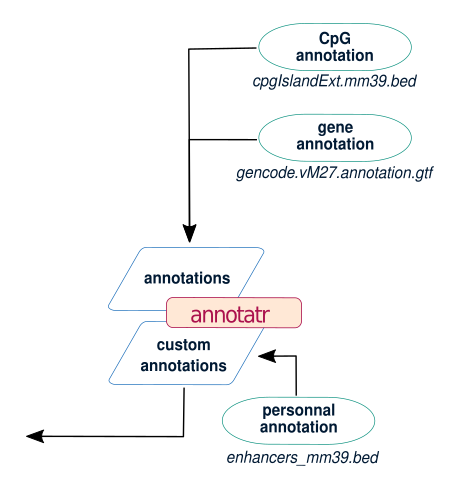
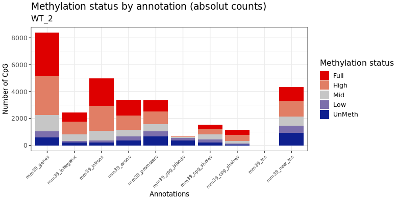
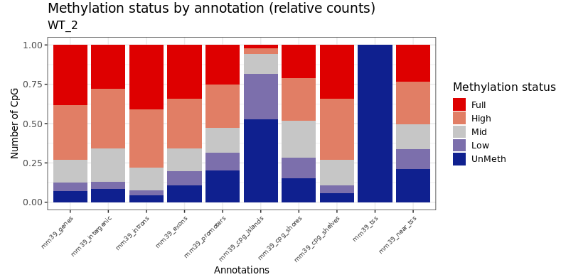

## Annotations

Methylator generates many figures to describe Methylation levels among the differents genomic features. Two files a required:    
- A GTF corresponding to genome version used for the mapping    
- A texte file with CpG island coordinates

!!! warning 
    The genome version specified in the configuration file, in the GTF file, and in the file for CpG island coordinates must be identical.

!!! Tip    
    Users can also give their own annotation file with coordinates of  ChIP-Seq or ATAC-Seq peaks or differentially expressed genes in order to perform multiomics integration analysis


**Scheme of the workflow section responsible for building annotations**



The R script Annotatr.R is responsible for building the annotations.    
To construct these annotations, Methylator relies on several packages:    
- [annotar](https://www.bioconductor.org/packages/devel/bioc/vignettes/annotatr/inst/doc/annotatr-vignette.html)    
- [GenomicRanges](https://bioconductor.org/packages/release/bioc/vignettes/GenomicRanges/inst/doc/GenomicRangesIntroduction.html)    
- [GenomicFeatures](https://kasperdanielhansen.github.io/genbioconductor/html/GenomicFeatures.html)    

We have chosen to reconstruct the annotations rather than using annotation databases to avoid dependency on them and to ensure that the annotations are consistently built.    

**Five gene features are represented:**    
- Genes    
- Intergenic    
- Introns    
- Exons    
- Promoters
  

Schematic of knownGene annotations ([source](https://bioconductor.org/packages/release/bioc/vignettes/annotatr/inst/doc/annotatr-vignette.html))

**And three types of regions around CGI are represented:**        
- CpG Islands    
- CpG Shores    
- CpG Shelves    


Schematic of CpG annotations ([source](https://bioconductor.org/packages/release/bioc/vignettes/annotatr/inst/doc/annotatr-vignette.html))


### Annotations description

**Genes**    
Use Genomicfeatures genes function
```R
GenomicFeatures::genes(txdb)
```

**Intergenic**        
Intersection of all annotations with genomic annotations. Anything not annotated as a gene is automatically annotated as intergenetic. 

**Exons**    
Uses genomicFeatures `exonsBy` function
```R
GenomicFeatures::exonsBy(txdb, by = 'gene')
```

**Introns**    
Based on the exons built previously. Considers gaps between exons as introns. 

**Promoters**        
Uses the gene annotations constructed above. 
Considers a promoter to be + or - 2000 base pairs upstream and downstream of the gene start.    

**TSS**    
Create the transcription start sites annotation 

```R
tss_gr = IRanges::promoters(genic_gr, upstream = 0, downstream = 1)
GenomicRanges::mcols(tss_gr)$type = sprintf('%s_tss', ORG)
```

**Near TSS**    
Create the near transcription start sites annotation
5000 base pairs upstream of the TSS and 500 base pairs downstream.

```R
near_tss_gr = IRanges::promoters(genic_gr, upstream = 5000, downstream = 500)
GenomicRanges::mcols(near_tss_gr)$type = sprintf('%s_near_tss', ORG)
```

**Cpg islands**    
Based on a .BED or .txt annotation file (available on UCSC GoldenPath) 

**CpG Shores**    
+/- 2kb upstream and downstream of CpG Islands

**CpG Shelves**    
+/- 4kb upstream and downstream of CpG Islands


The advantage of this approach is that it allows users familiar with the R programming language to modify or add annotations according to their needs.

!!! warning
    When annotating CpGs, DMCs, DMTs, or DMRs, whenever one of these elements overlaps with an annotation, it is associated with that annotation. As a result, the same CpG can be annotated as being located in a gene, a CpG island, and an intron simultaneously. This explains why in the annotation count figures, some categories have more elements than others (e.g., genes). That's why it's also interesting to look at the figures in relative count.


### Methylation status in absolut count


### Methylation status in relative count



## Metadata for user annotation 

|    annotation_tracks   |  group |      name     | 
| ---------------------- | ------ | ------------- | 
| hg19.simplerepeat.txt  | repeat | tandem_repeat |
| hg19.nestedRepeats.txt | repeat | nested_repeat |
| hg19.atacseq.txt       |  atac  |      atac     |

This is necessary only if you select the **customs annotations** feature in the configuration file. 
In this case, the workflow will produce, in addition to the figures linked to default annotations, 
the same figures but for user-provided personal annotations. 'Annotation_tracks' corresponds to 
the names of the files containing the annotations, **group** to the different annotation categories, 
and **name** to the names that will be given to the annotations in the reports.

``` yaml 
# ===== Customs Annotations ===== #
CUSTOM_ANNOT: yes # yes or no 
METAFILE_ANNOT: configs/metadata_annot.tsv
CUSTOM_ANNOT_PATH: my_bank/
MERGE_WITH_BASICS_ANNOT: yes # yes or no
```
Additionally, you need to specify the path to the folder containing the annotation files and the path to the metadata
You can also choose to merge custom annotations with standard annotations to have a single plot each time.


!!! warning
    The expected file format for creating custom annotations is as follows : 
    
|  chr | start |  end  |                                 metadata                                   |
| ---- | ----- | ----- | -------------------------------------------------------------------------- |
| chr1 | 10000 | 10468 | trf	6	77.2	6	95	3	789	33	51	0	15	1.43	TAACCC          | 
| chr1 | 10627 | 10800 | trf	29	6	29	100	0	346	13	38	47	0	1.43	AGGCGCGCCGCGCCGGCGC | 
| chr1 | 10757 | 10997 | trf	76	3.2	76	95	2	434	17	30	45	6	1.73	GGCGCAGGCGCAGAGAGGC | 
| chr1 | 11225 | 11447 | trf	117	1.9	121	80	14	273	12	32	33	20	1.9	CGCCCCCTGCTGGCGAC       | 

With chromosomal coordinates (chromosomes | start | end) along with any potential supplementary columns.    


There is a script called `search_bank.sh`, in the `scripts` folder, which, when executed, automatically downloads (when possible) all the necessary annotation files for launching the workflow from UCSC Golden Path. It takes as an argument the name of the reference genome of the species in question. For example:

``` sh
srun scripts/search_bank.sh mm39 
```


All annotation files are then downloaded into the folder `my_bank` provided for this purpose.


