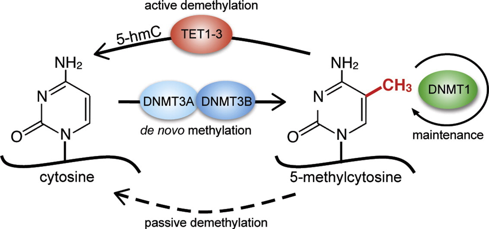
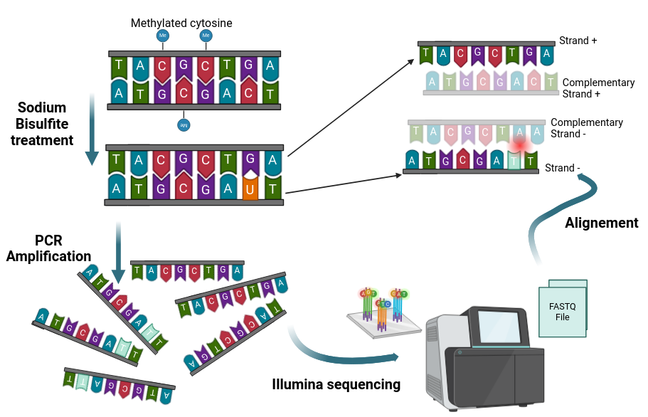
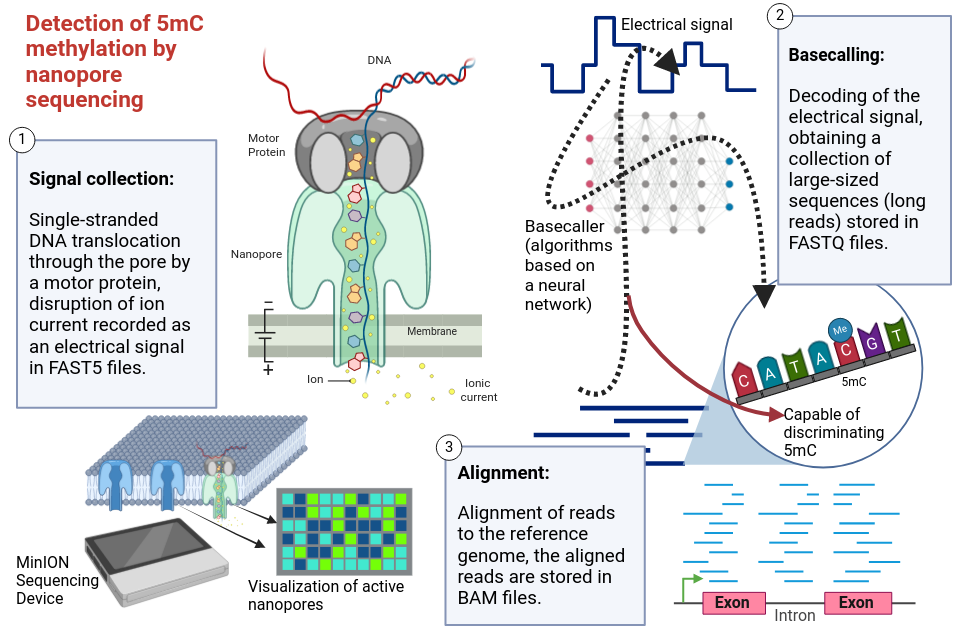

# Biological Context

Epigenetic marks regulate gene transcription, as well as genome replication, and repair. In mammals, DNA methylation on CpGs was shown to be
essential for normal development and is associated with a number of key processes including genomic imprinting, X-chromosome inactivation, repression of
transposable elements, aging, and carcinogenesis. At the molecular level, DNA methylation has been identified as directly repressing transcription by inhibiting the binding of specific transcription factors, and/or indirectly, by recruiting methyl-CpG binding proteins, which themselves interact with corepressors. Thus, in gene promoter regions, demethylated CpG islands are generally associated with transcriptional activity, while methylated CpG islands silence gene expression. DNA methylation has also been associated with genome stability by repressing the activity of transposable elements.  

##  DNA Methylation 
In mammals genomes, DNA methylation is a reversible epigenetic modification involving the addition of a methyl group to the fifth carbon of cytosine, forming 5-methylcytosine (5mC), methylation is primarily observed in a CpG dinucleotide context. Non-CG methylation (CHG or CHH) is more commonly observed among plants and fungi.  
  
  
Key players in the DNA methylation pathway ([https://doi.org/10.1016/j.jmb.2017.02.008](https://doi.org/10.1016/j.jmb.2017.02.008))

## Enzymatic actors
DNA methylation is carried out by DNA methyltransferases, a family of enzymes among which we find Dnmt1, primarily involved in maintaining methylation during genome replication, and Dnmt3a/b, which plays a major role in de novo methylation acquisition, particularly during embryonic development.

## Localisation 
DNA methylation is a genome-wide phenomenon, except for certain regions that are CpG-rich (CpG islands or CGIs). These regions, averaging about 1kb and composed of over 50% CpG sites, are generally demethylated, especially when associated with active gene promoters. It's noteworthy that in humans, 70% of gene proximal promoters are associated with a CpG island.  

## Physiophatologies associées 
DNA methylation dysregulation, meaning hyper- or hypomethylation of CpG sites, is observed in various pathologies and cancers. In the case of cancers, this disruption of methylation manifests as global hypomethylation, which can lead to genomic instability by reactivating transposons, observed in early stages of the disease and followed by more targeted hypomethylation of certain genes, enabling tumor cells to adapt to their environment and form metastases, and hypermethylation of CpG islands, resulting in gene inactivation. Specifically, those involved in cell cycle regulation, DNA repair, chromatin remodeling, cell signaling, transcription, and apoptosis. This marked change in methylation in specific genomic regions between physiological and pathological conditions is a key element that biologists and clinicians seek to identify, which can be termed DMRs (differentially methylated regions), defined as a collection of DMCs (differentially methylated cytosines. **In cancer cells, global hypomethylation at repetitive sequences might cause genetic instability, whereas site-specific CpG island promoter hypermethylation could lead to silencing of TSGs.**  

      

    
## Profiling genome-wide DNA methylation

### Bisulfite - Sequencing (BS-Seq)

**Whole Genome Bisulfite Sequencing**
Whole-genome bisulfite sequencing (WGBS) requires, prior to high-throughput sequencing (such as Illumina sequencing), the treatment of the studied samples with sodium bisulfite. This treatment converts unmethylated cytosines into uracil, which is subsequently converted to thymine during PCR amplification. This base modification enables the discrimination between methylated and unmethylated cytosines after alignment to the reference genome. However, the alignment process is complex and computationally intensive, and the chemical treatment with sodium bisulfite severely degrades DNA.  

**Reduced-Representation Bisulfite Sequencing**
The Reduced Representation Bisulfite Sequencing (RRBS) method is similar to WGBS, with the key distinction that only CpG-rich regions are sequenced, as selected by restriction enzymes. This method reduces sequencing costs but does not explore the methylation of the entire genome.  

### Nanopore Sequencing 

Nanopore sequencing relies on a set of pores, typically a few nanometers in diameter, integrated into a membrane subjected to an electric current. When a DNA fragment passes through a pore, each base disrupts the current in its own way. This disruption is then captured by electrodes and recorded as an electrical signal. Algorithms, known as "basecallers," based on neural networks, are then used to decode the signal and reconstruct the DNA fragment sequence in real-time. Some of these algorithms are also capable of distinguishing modified bases, including 5mC and 5hmC, enabling methylation quantification without the need for bisulfite treatment.  

**Reduced-Representation Methylation Sequencing**
The RRMS method relies on nanopore sequencing coupled with another Oxford Nanopore Technology (ONT) method called "Adaptive Sampling," which enriches regions of interest by eliminating non-targeted regions directly during sequencing.  

    

## References

1. [https://planet-vie.ens.fr/thematiques/sante/pathologies/epigenetique-et-cancer](https://planet-vie.ens.fr/thematiques/sante/pathologies/epigenetique-et-cancer)
2. [https://www.wikiwand.com/en/DNA_methylation](https://www.wikiwand.com/en/DNA_methylation)
3. [Lin Lehang, Cheng Xu, Yin Dong.
Aberrant DNA Methylation in Esophageal Squamous Cell Carcinoma:
Biological and Clinical Implications. Frontiers in Oncology (2020)](https://www.frontiersin.org/journals/oncology/articles/10.3389/fonc.2020.549850/full)
4. [https://nanoporetech.com](https://nanoporetech.com)
5. [https://github.com/parisepigenetics/Methylator](https://github.com/parisepigenetics/Methylator)
6. [Dahlet, T., Argüeso Lleida, A., Al Adhami, H. et al. Genome-wide
analysis in the mouse embryo reveals the importance of DNA methylation
tfor transcription integrity. Nat Commun 11, 3153 (2020)](https://www.nature.com/articles/s41467-020-16919-w)

