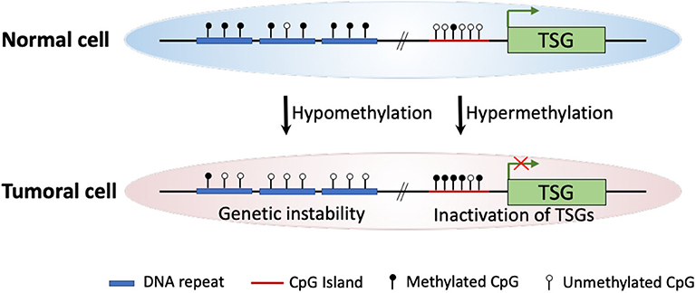

# Biological Context

Epigenetic marks regulate gene transcription, as well as genome replication, and repair. In mammals, DNA methylation on CpGs was shown to be
essential for normal development and is associated with a number of key processes including genomic imprinting, X-chromosome inactivation, repression of
transposable elements, aging, and carcinogenesis. Au niveau moléculaire la méthylation de l'ADN à été identifiée comme permettant de réprimer directement la transcription en inhibant la liaison de facteurs de transcription spécifiques, et/ou indirectement, en recrutant des protéines de liaison méthyl-CpG, elles mêmes en interaction avec des corépresseurs. 
Ainsi, dans les régions promotrices des gènes, des îlots CpG dé-méthylés vont généralement être associés à une activité transcriptionnelle, tandis que des îlots CpG méthylés vont réduire au silence l'expression des gènes. La méthylation de l’ADN à également été associé à la stabilité du génome en réprimant l’activité des éléments transposables. 

##  DNA Methylation 
La méthylation de l’ADN est une modification épigénétique réversible qui consiste en l’ajout d’un groupement méthyle sur le cinquième carbone de la cytosine pour former la 5-méthylcytosine (5mC) comme illustré sur la figure 1. Chez les mammifères, la méthylation est essentiellement observée dans un contexte de di-nucléotides CG (CpG). La méthylation non  CG (CHG ou CHH) est plus communément
observée parmi les plantes et les fonges.

## Acteurs enzymatiques 
La méthylation de l’ADN est assurée par les DNA methyltransferases (Figure 1), une famille d’enzymes parmi lesquelles ont trouve **Dnmt1**, principalement impliquée dans le maintien de la
méthylation lors de la réplication du génome, et **Dnmt3a/b**, dont le rôle majeur est l’acquisition de novo de la méthylation, au cours du développement embryonnaire notamment. 

## Localisation 
la méthylation de l'ADN est un phénomène global à l’échelle du génome, à l’exception de certaines régions plus riches en CpG (îlots CpG ou CGI). Ces régions d’en moyenne 1kb et
composée à plus de 50% de CpG sont généralement déméthylées, en particulier lorsqu’elles sont associées à des promoteurs de gènes actifs. Il est intéressant de noter que chez
l’humain, 70% des promoteurs proximaux des gènes sont associées à un îlot CpG.

## Physiophatologies associées 

Une méthylation dérégulation de l’ADN, c’est à dire une hyper ou hypométhylation des CpG, est observée dans diverses pathologies et cancers. Dans le cas des cancers, cette perturbation de la méthylation s’exprime par une hypométhylation globale, qui peut être à l’origine d’une instabilité génomique par la réactivation de transposons, observé dans les cas précoces de la maladie et suivie d’une hypométhylation plus ciblés de certains gènes, permettant l’adaptation des cellules tumorales à leur environnement et la formation des métastases, et une hyperméthylation des îlots CpG, conduisant à une inactivations de gènes. En particulier ceux impliqués dans la régulation du cycle cellulaire, la réparation de l'ADN, le remodelage de la chromatine, la signalisation cellulaire, la transcription et l'apoptose. Ce changement marqué de la méthylation dans des zones précises du génome entre conditions physiologiques et pathologiques est un élément clef que les biologistes  et les cliniciens cherchent à identifier, et que l’on peut qualifier de DMR (pour régions différentiellement méthylées), et qui se définie comme étant une collection de DMC (cytosines différentiellement méthylées).

  
In cancer cells, global hypomethylation at repetitive sequences might cause genetic instability, whereas site-specific CpG island
promoter hypermethylation could lead to silencing of TSGs

## Profiling genome-wide DNA methylation

### Bisulfite - Sequencing (BS-Seq)

**Whole Genome Bisulfite Sequencing**
Le WGBS nécessite, avant le séquençage à haut débit (de type Illumina), le traitement des échantillons étudiés au bisulfite de sodium, ce qui va avoir pour effet de convertir les cytosines
non-méthylées en uracile puis en thymine lors de l’amplification par PCR. Cette modification de base va permettre, après l’alignement sur le génome de référence, de discriminer les
cytosines méthylées de celles non-méthylées. Cependant l’alignement est complexe et coûteux en calculs et le traitement chimique au bisulfite de sodium dégrade fortement l’ADN.

**Reduced-Representation Bisulfite Sequencing**
La méthode RRBS est un procédé similaire au WGBS à la simple distinction que seules les régions riches en CpG sont séquencées car sélectionnées par des enzymes de restrictions.
Elle permet de réduire les couts de séquencage mais n'explore pas la méthylation du génome en entier. 

### Nanopore Sequencing 

Le séquençage nanopore repose sur un ensemble de pores (de quelques nanomètres de diamètres), intégrer dans une membrane soumise à un courant électrique. Lorsque un fragment d’ADN passe à travers un pore, chaque base perturbe le courant à sa manière. Cette modification alors est capté par des électrodes et enregistré sous forme d’un signal électrique. Des algorithmes, appelés «basecaller»,  basés sur des réseaux de neurones sont ensuite utilisé pour décoder le signal et retrouver la séquence du fragment d’ADN, ce qui permet un séquençage en temps réel. Certains de ces algorithmes sont également capable de différencier les bases modifiées, dont la 5mC, ce qui permet de quantifier la méthylation sans passer par un traitement au bisulfite.

**Reduced-Representation Methylation Sequencing**
La méthode RRMS utilise le même procédé d’enrichissement des îlots CpG que le RRBS mais avec une détection de la méthylation par séquençage nanopore.

## References

1. [https://planet-vie.ens.fr/thematiques/sante/pathologies/epigenetique-et-cancer](https://planet-vie.ens.fr/thematiques/sante/pathologies/epigenetique-et-cancer)
2. [https://www.wikiwand.com/en/DNA_methylation](https://www.wikiwand.com/en/DNA_methylation)
3. [Lin Lehang, Cheng Xu, Yin Dong.
Aberrant DNA Methylation in Esophageal Squamous Cell Carcinoma:
Biological and Clinical Implications. Frontiers in Oncology (2020)](https://www.frontiersin.org/journals/oncology/articles/10.3389/fonc.2020.549850/full)
4. [https://nanoporetech.com](https://nanoporetech.com)
5. [https://github.com/parisepigenetics/Methylator](https://github.com/parisepigenetics/Methylator)
6. [Dahlet, T., Argüeso Lleida, A., Al Adhami, H. et al. Genome-wide
analysis in the mouse embryo reveals the importance of DNA methylation
tfor transcription integrity. Nat Commun 11, 3153 (2020)](https://www.nature.com/articles/s41467-020-16919-w)

