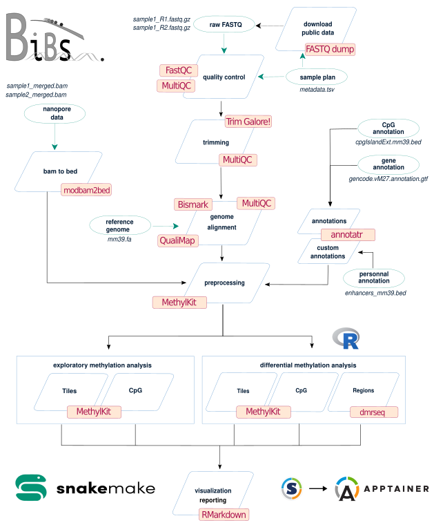

# Methylator, a DNA methylation analysis workflow

<small>Maintained by [BiBs](mailto:bibsATparisepigenetics.com). Last update : 25/04/2024. Methylator v0.1. </small>  

Methylator is a complete Snakemake workflow to analyse DNA methylation data. Methylator runs in a dedicated Apptainer image to allow for reproducibility and was optimized to compute effciently the data on HPC clusters. We aim to make those complex analyses do able by biologists with no or little bioinformatics background. Implemented by [BiBs-EDC](https://parisepigenetics.github.io/bibs/), this pipeline runs effectively on both IFB and iPOP-UP clusters.

## Pipeline scheme 
{: width=800px }

!!! warning "Disclaimer" 
    This is a BETA version of the workflow, and of this documentation !     There is no guarantee ! If you encounter troubles or need additional tools or features, you can create an issue on the [GitHub repository](https://github.com/parisepigenetics/WGBSflow/issues) or email directly [BiBs](mailto:bibsATparisepigenetics.com).

!!! quote "Acknowledge BiBs example"   
    If you use this workflow to analyse your data, don't forget to **acknowledge BiBs** in all your communications !    
    **For EDC people :** We thank the Bioinformatics and Biostatistics Core Facility, Paris Epigenetics and Cell Fate Center for bioinformatics support.   
    **For External users :** We thank the Bioinformatics and Biostatistics Core Facility, Paris Epigenetics and Cell Fate Center for sharing their analysis workflows.

## Required Knowledge for Quick Start

!!! warning
    Methylator was designed to be as user-friendly as possible; however, it is a tool dedicated to complex biological analyses and requires certain prerequisites to ensure a quick start and understanding of the analyses performed.

- Be comfortable with the UNIX/Linux operating system, particularly the file structure and main commands.
- Know how to use a computing cluster (HPC) with the SLURM scheduler.
-  Understand the fundamental steps of DNA methylation analysis and the associated file formats. The [biological context](biological_context.md) section can be used for this.
-  Have general knowledge in statistics/biostatistics.

## Avantages et limitations

*Insérer un tableau de benchmarling d'autres workflow*

Methylator ne dispose d'une interface graphique, son utilisation nécessite donc des connaissances minimales avec le système d'exploitation Linux. 

L'utilisateur est libre de choisir les seuils et paramètres qui lui semblent les plus appropriés à ses analyses,pour des valeurs en dehors des plages recommandés Methylator ne peut garantir l'interprétabilités des résultats. 

## Futurs développements    

Actuellement Methylator ne prend pas en charge les analyses de puces de méthylation (voir section biological contexte). Mais une intégration prochaine est en cours de réflexion. Methylator a été pensé pour être modulable et évolutif, l'intégration de nouveaux outils/fonctionalités par des utilisateurs avancés est tout à fait possible. 

## Table of contents    
- [Biological context](biological_context.md)
- [Before starting](before_start.md)
- [Installation](installation.md)
- [Description](description.md)
- [Adapt the workflow to cluster](adapt_cluster.md)
- [Transfert your data](transfert_data.md)
- [Preparing the run](preparing_run.md) 
- [Configuration files examples](configuration_file_example.md)
- [Annotations](annotations.md)
- [Quick start with the test dataset](quick_start.md)
- [Running your analysis step by step](running.md)
- [Results](results.md)
- [Extra Help !](extra_help.md)
- [Singularity](singularity_image.md)
- [Resources](resources.md)

