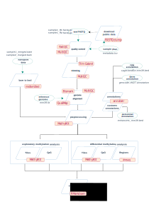

# Methylator, a DNA methylation analysis workflow

<small>Maintained by [BiBs](mailto:bibsATparisepigenetics.com). Last update : 25/04/2024. Methylator v0.1. </small>  

Methylator is a pipeline for analyzing DNA methylation, an epigenetic mark. It enables the study of **Cytosine methylation** (5mC) in a mammalian context. The workflow is compatible with short read sequenced Sodium Bisulfite-treated samples (BS-seq) for detection of 5mC, whether whole genome or reduced representation and long reads sequencing with Nanopore for direct detection of 5mC and 5hmC.    

Our tool addresses two fundamental questions: quantifying methylation ("How much") and locating it ("Where"). An exploratory analysis provides insights (Quality control and statistics) into the samples at both global and local scales, from base-pair resolution to larger genomic regions, in association with annotations of your choice. A differential analysis allows for comparisons between various biological conditions to identify DMCs, DMTs and DMRs (Diffenrentially Methylated Cytosines, Tiles and Regions). Additionally, part of the analysis is designed to help users optimally set the necessary thresholds and filters for their investigations.    

Methylation analyses can be laborious and time-consuming. They require numerous tools and involve handling large volumes of data. Methylator is designed to address these challenges. It is intended for biologists and bioinformaticians seeking an automated, comprehensive, FAIR, and turnkey solution to facilitate their analyses. No special installation is required beyond cloning the [GitHub repository](https://github.com/parisepigenetics/WGBSflow). The workflow component allows for the automatic chaining of different steps. Analysis results are easy to share with html reports. Using the workflow does not require advanced bioinformatics knowledge, but due to its open-source and modular nature, experienced users can modify or add functionalities according to their needs.    

In line with FAIR principles, Methylator uses Apptainer and Conda tools to containerize and standardize the entire environment necessary for its operation. This ensures the reproducibility and sustainability of the results.Implemented by [BiBs-EDC](https://parisepigenetics.github.io/bibs/), this pipeline runs effectively on both IFB and iPOP-UP clusters.

## Pipeline scheme 
{: width=800px }

!!! warning "Disclaimer" 
    This is a BETA version of the workflow, and of this documentation !     There is no guarantee ! If you encounter troubles or need additional tools or features, you can create an issue on the [GitHub repository](https://github.com/parisepigenetics/WGBSflow/issues) or email directly [BiBs](mailto:bibsATparisepigenetics.com).

!!! quote "Acknowledge BiBs example"   
    If you use this workflow to analyse your data, don't forget to **acknowledge BiBs** in all your communications !    
    **For EDC people :** We thank the Bioinformatics and Biostatistics Core Facility, Paris Epigenetics and Cell Fate Center for bioinformatics support.   
    **For External users :** We thank the Bioinformatics and Biostatistics Core Facility, Paris Epigenetics and Cell Fate Center for sharing their analysis workflows.

## Limitations

Methylator does not have a graphical interface, so its use requires basic knowledge of the Linux operating system.

The user is free to choose the thresholds and parameters they deem most appropriate for their analyses. However, for values outside the recommended ranges, Methylator cannot guarantee the interpretability of the results.

## Futurs développements    

Currently, Methylator does not support methylation array analyses (see the [Biological Context section](biological_context.md). However, integration is under consideration for a future update.

## Table of contents    
- [Biological context](biological_context.md)
- [Requirements](before_start.md)
- [Setup](installation.md)
- [Description](description.md)
- [Adapt the workflow to cluster](adapt_cluster.md)
- [Transfert your data](transfert_data.md)
- [Preparing the run](preparing_run.md) 
- [Configuration files examples](configuration_file_example.md)
- [Annotations](annotations.md)
- [Quick start with the test dataset](quick_start.md)
- [Running your analysis step by step](running.md)
- [Results](results.md)
- [Extra Help !](extra_help.md)
- [Singularity](singularity_image.md)
- [Resources](resources.md)

**Methylato was implemented by BiBs-EDC facility, the Bioinformatics and Biostatisics platform of the Epigenetics and Cell Fate unit, a multidisciplinary research centre located on the Grands Moulins campus of Université Paris Cité** 

